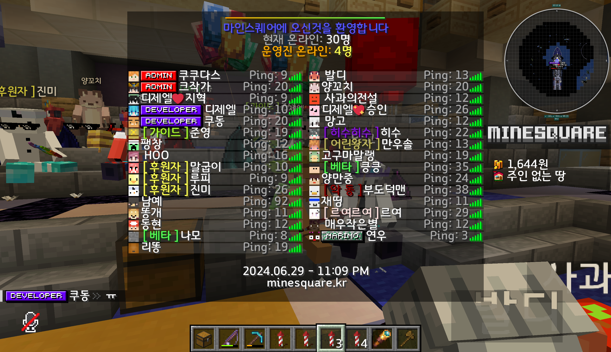

# KUDONG-Plugins
마인크래프트 서버사이드 플러그인

경기대학교 / 한양대학교 에리카 마인크래프트 메타버스 서버 개발 및 운영
(2024.02.01 ~ 2024.09.01)

### 1. Towny-Dynmap

* 경기대학교

* 한양대에리카

인게임 부동산 실시간 맵 지원

### 2. Entity-Riding

인게임 탈것 지원

### 3. Nickname

인게임 한글 닉네임 지원

### 4. Book

인게임 책 GUI 지원

### 
